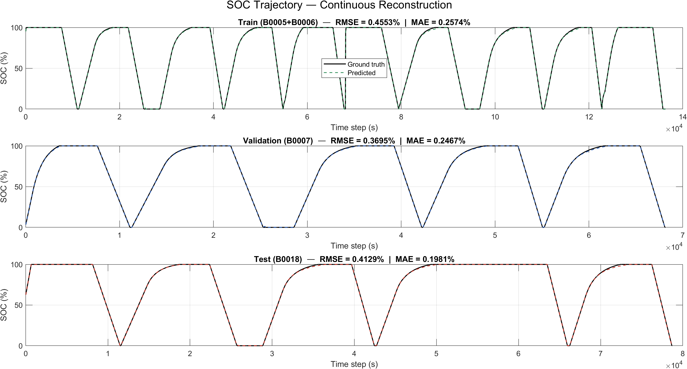
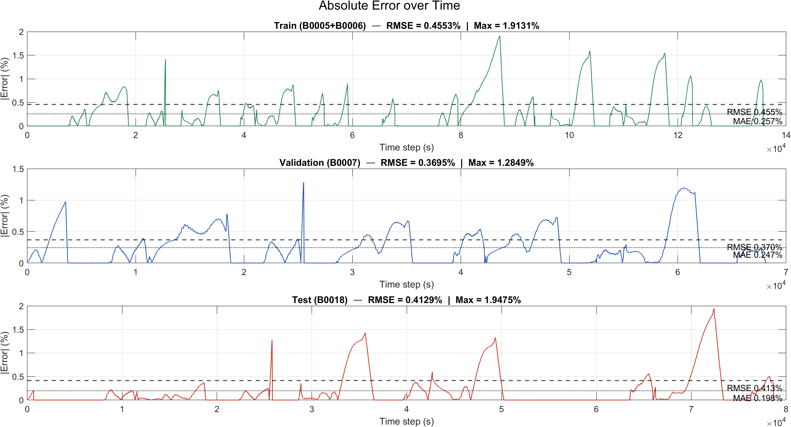
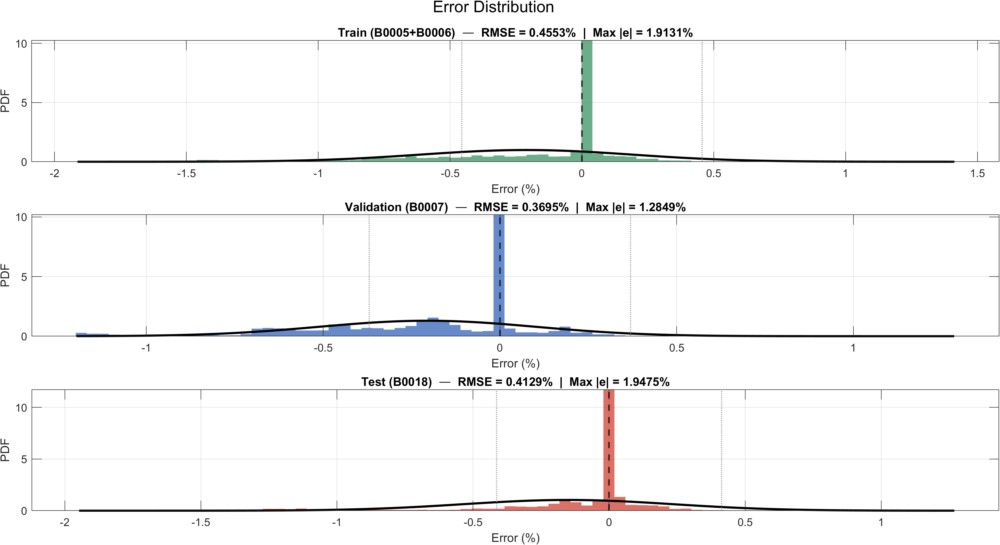
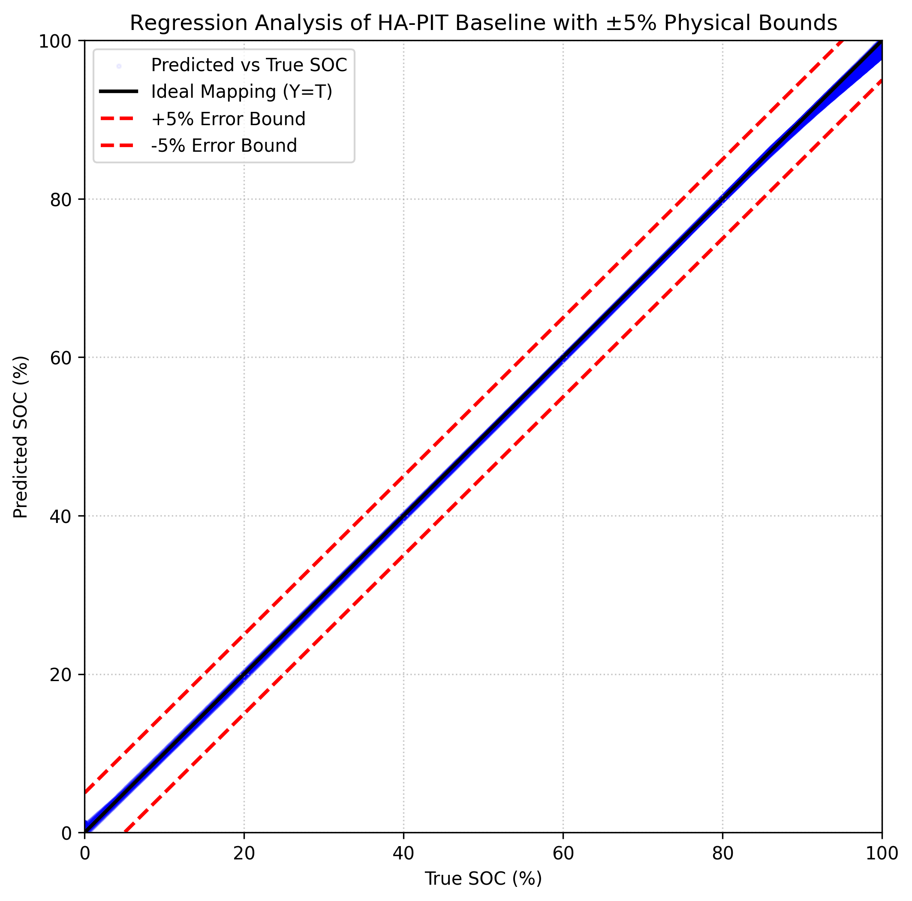
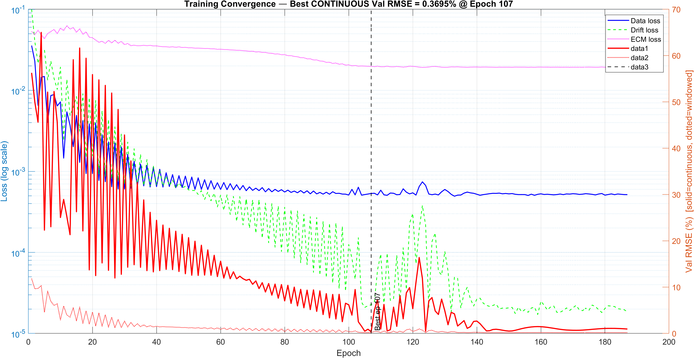
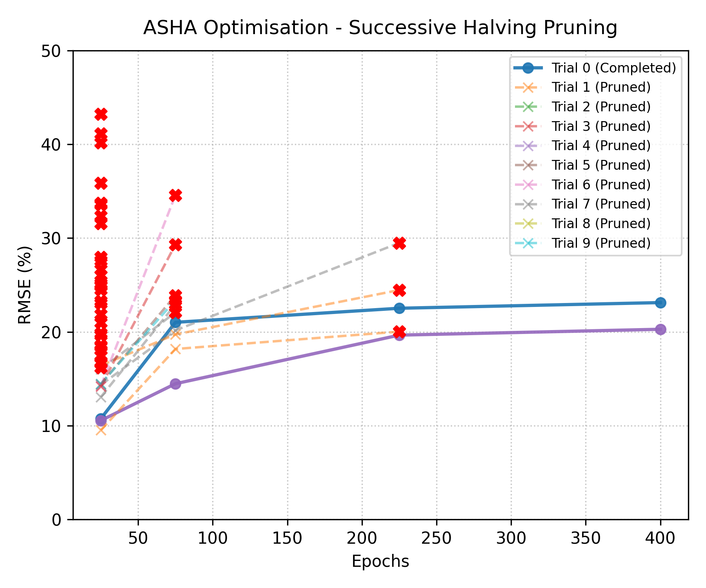
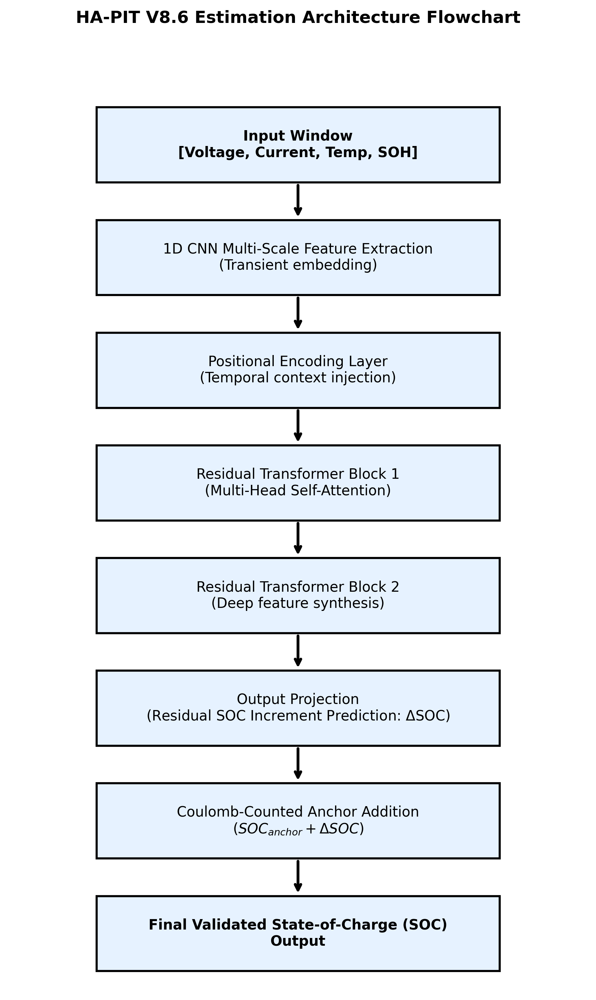

# Ageing-Aware Physics-Informed Transformer for Battery State-of-Charge Estimation

Lithium-ion state-of-charge estimation to **0.41% RMSE on a cell the model never saw**, and **0.50% across a cell's complete 338-cycle life** from fresh to end-of-life. A multi-scale CNN feeds two self-attention blocks; a five-term physics-informed loss built on a first-order Thevenin equivalent circuit keeps it honest; the network predicts a *residual correction* on a Coulomb-counting anchor rather than absolute SOC, which removes long-horizon integration drift by construction.

Trained end to end in 1 h 38 m on a laptop CPU: Ryzen 5 5500U, 8 GB RAM, no GPU.

Final-year project, Universiti Teknologi MARA Shah Alam, August 2026.
Supervisor: Dr Masoud Ahmadipour.

---

## Results

Trained on B0005 + B0006, validated on B0007, tested on **B0018**. The test cell is fully held out and was never seen during training or model selection.

| Split | Cell(s) | RMSE | MAE | Max error | R² |
|---|---|---:|---:|---:|---:|
| Train | B0005 + B0006 | 0.4553% | 0.2574% | 1.9131% | 0.9998 |
| Validation | B0007 | 0.3695% | 0.2467% | 1.2849% | 0.9999 |
| **Test, held out** | **B0018** | **0.4129%** | **0.1981%** | **1.9475%** | **0.9998** |

Two stress tests beyond the main split:

| Stress test | What it probes | RMSE | MAE | Max error | R² |
|---|---|---:|---:|---:|---:|
| B0005, all 338 cycles | Complete life, 2.0 Ah fresh → 1.4 Ah end-of-life | 0.4988% | 0.2781% | 2.6364% | 0.9998 |
| UDDS drive cycle | Out-of-distribution load profile | 5.5290% | 4.2264% | 11.1802% | 0.9707 |

The 338-cycle run is the one worth pointing at: 2.29 million timesteps of continuous reconstruction across a cell's entire degradation history, staying under 0.5% the whole way while the physics constraint recalibrates capacity and internal resistance as the cell fades.

The UDDS number is the generalisation boundary. Trained on constant-current NASA cycling, the model loses an order of magnitude on an automotive drive cycle. It's here because it's the honest limit of what this training set supports.

### What these numbers are measured against

The NASA dataset carries no independent SOC sensor, so ground truth is built the standard way for it: Coulomb counting on measured current, with OCV recalibration at settled rest periods ([`prepareBatteryDataV9.m`](src/matlab/prepareBatteryDataV9.m), lines 189-203). Evaluation reproduces that same recursion with the network's correction added to each increment, so a zero-correction network reproduces the labels exactly and the reported RMSE measures the deviation the *learned correction* introduces.

Two consequences worth stating plainly:

1. **These figures are not a like-for-like win over Coulomb counting on this data.** On a clean current signal, Coulomb counting *is* the reference. Published error ranges (open-loop Coulomb counting at 5-10%, adaptive EKF at 1.5-3%, LSTM at 2-4%) are measured against true reference SOC in instrumented cells. Putting them in the same column as the table above would compare two different quantities.
2. **The place the network has to earn its keep is a corrupted current signal**, which is what the bias ablation below actually tests, and where the result turned out more interesting than a clean win.

### Error behaviour

| | |
|---|---|
|  |  |
| Predicted vs true SOC, train / validation / test stacked | Absolute error over time with RMSE and MAE lines |
|  |  |
| Error histogram with fitted normal | Predicted vs true scatter, fitted slope and R² |



Loss components on a log-scale left axis; continuous *and* windowed validation RMSE on the right, solid versus dotted, with the selected epoch marked. Best epoch 107, early stop at 187.

---

## Bias robustness: the result that didn't go as planned

A constant current-sensor offset is the realistic failure mode for anything built on Coulomb counting: the bias integrates and the estimate walks away. If the network is genuinely fusing voltage evidence rather than integrating current with extra steps, an injected bias should hurt it less than it hurts pure Coulomb counting.

Bias injected into both the integration current and the network's input channel:

| Injected bias | Pure Coulomb | HA-PIT V8.6 | HA-PIT, HPO config |
|---|---:|---:|---:|
| 0.00 A | 0.0000% | 0.4129% | 0.6518% |
| 0.05 A | 2.4300% | 2.4511% | **1.5997%** |
| 0.10 A | 4.3162% | 4.3683% | **3.4446%** |

**V8.6, the configuration with the best clean accuracy, reaches near-parity and does not beat pure Coulomb counting under bias.** That was the target and it was not met.

The configuration trained with the hyperparameters found by the Bayesian-optimisation + PCGrad search *does* beat it: 0.83 pp better at 0.05 A, 0.87 pp better at 0.10 A, paid for with 0.24 pp of clean accuracy.

The two configurations sit at different points on a clean-accuracy versus sensor-robustness trade-off, and which one you would deploy depends on how much you trust your current sensor. That is not the finding this experiment set out to produce, and it is more useful than the one it was aiming at.

One note on the protocol, because it matters: an earlier version of this ablation was wrong. V8.5 biased the integration current while feeding the network clean inputs, which made counteraction impossible in principle. Those rows measured correction noise, not robustness. The table above uses the corrected protocol, and fixing it made the reported result worse.

---

## Automated hyperparameter search lost to hand tuning

Three searches, one shared 8-parameter space, roughly 100 hours of compute.

| Method | Search strategy | Trials | Best trial RMSE | Compute |
|---|---|---:|---:|---:|
| ASHA | Optuna TPE + successive halving | 40 (38 pruned) | 20.28% | 24.2 h |
| BOHB | Optuna TPE + Hyperband + 12-trial refinement | 55 (45 pruned) | 13.50% | 48.3 h |
| Bayesian optimisation + PCGrad | GP surrogate, expected-improvement acquisition, gradient surgery | 55 | 2.25% | 27.9 h |

Those trial figures are **not** directly comparable to the 0.4129% baseline. The search harness runs `seqLen=240` and the earlier four-term loss, deliberately, because halving the window roughly doubles trial throughput. The fair comparison is to take the best configuration any search found and re-run it through the full production pipeline:

| Configuration | Continuous test RMSE |
|---|---:|
| Hand-tuned baseline (V8.6) | **0.4129%** |
| Best searched config, re-run at full fidelity | 0.6518% |

**Manual tuning won.** The mechanism is the interesting part: the residual error the searches were fighting was accumulated integration drift, not a hyperparameter problem. No point in the search space fixes it, because the fix was structural: a drift-targeted loss term, a model-selection metric that can actually see drift, and a learning-rate horizon decoupled from the epoch budget. Those three changes moved validation RMSE from 3.05% to 0.37%; the best of 150 searched configurations moved it to 2.25%.

Two harness-side observations that fed back into the design: ASHA's best trial *degraded* on the validation metric between epoch 25 (10.55%) and epoch 400 (20.28%), and the harness returns the value at the milestone epoch rather than the best seen, so within-trial divergence is never rewound. And none of the three harnesses carry the drift loss or the continuous selection metric, so they were searching for a good configuration under a metric structurally blind to the actual problem.

Full trial data is in [`results/hpo/`](results/hpo/); the analysis is in [`docs/hpo-study.md`](docs/hpo-study.md).



---

## How it works



**Residual formulation.** The network never predicts SOC, and never predicts the per-step increment either. It predicts a small correction on top of an exact, non-learned Coulomb term:

```
ΔSOC[k] = I_b[k]·Δt / C_dyn[k]   +   c_k
          └── exact physics ──┘      └─ learned ─┘
```

When a network has to reproduce `I·Δt/C` itself, MSE training systematically attenuates the learned mapping, and over an unanchored ~5,600-step segment that per-step shrinkage compounds into several percent of drift. With the Coulomb term baked into the arithmetic there is nothing to attenuate. A zero-correction network reproduces the labels to ~1e-9, verified numerically before the design was committed to. The correction is scaled by 1e-3, encoding the prior that it should be small.

**Ageing awareness.** Capacity is not a constant. The pipeline detects contiguous active-current runs, treats any run exceeding 1000 A·s as a fresh capacity estimate, and carries it forward, so the Coulomb denominator tracks fade rather than assuming the nameplate 2 Ah. Internal resistance follows it:

```
R₀(T, C) = R_ref · exp[(Ea/R)(1/T_K − 1/T_ref)] · (C_nom / C_dyn)^0.5
```

Arrhenius in temperature, power law in capacity fade. Observed range across the dataset: 0.051-0.126 Ω. This is what makes the physics constraint still valid at 1.4 Ah, where a fresh-cell ECM would be badly wrong.

**Five-term loss.**

| Term | Weight | Job |
|---|---:|---|
| `L_data` | 1.0 | SOC fidelity, weighted to counter SOC-range imbalance |
| `L_Ah` | 10.0 | Keeps the correction small: stay near Coulomb counting unless the voltage says otherwise |
| `L_end` | 0.5 | Penalises accumulated within-window drift, which per-step MSE cannot see |
| `L_drift` | 30.0 | Squares the *sum* of unanchored deviations, making a 2.6e-5/step bias visible at the same order as the data loss |
| `L_ECM` | 0.5 | Thevenin terminal-voltage consistency, masked during fast current steps, frozen for the first 15 epochs |

`L_drift` is the term that mattered. Squaring the per-window sum rather than the mean of squares is what makes a per-step bias too small to see individually show up in the loss at all.

**Relaxation-gated anchoring.** Right after current drops to zero, terminal voltage is still relaxing toward open circuit. Thirty seconds into a rest it can still be off by several hundred millivolts. Anchoring against that *injects* error. A rest step earns the right to re-anchor only if current is under 0.05 A, the rest has lasted at least 120 s, the step is at least 30 s past the start of the rest, and the trailing voltage slope is under 2e-4 V/s. That gate fires on 6.5-12.8% of steps, and the same mask is shared by label construction, the drift loss, and evaluation, computed once so the three can't diverge.

**Two metrics, deliberately.** Continuous reconstruction is the deployment metric: integrate across the whole sequence, one pass, no per-window resets. Windowed-oracle anchors each window at its true starting SOC and measures correction quality alone. The gap between them localises the error. This is not decoration. V8.4 scored 0.39% windowed while carrying 3.05% continuous error, and only the paired metric made that visible.

Architecture: 80,866 learnable parameters. Parallel 1-D convolutions at kernel 3/5/9 → concat → LayerNorm → ReLU → dropout → FC(64) → positional encoding → two self-attention blocks (4 heads, dim 64, FFN expansion 2) → FC to two outputs (SOC correction, OCV correction).

Full derivation, every equation, and the reasoning behind each design choice: [`docs/technical-reference.md`](docs/technical-reference.md).

---

## Repository layout

```
src/matlab/           Baseline model, data pipeline, custom layer, inference harness
src/hpo/              Three hyperparameter searches: ASHA, BOHB, BayesOpt+PCGrad
src/data_prep/        NASA raw data → stitched lifecycle CSVs
data/                 Four derived lifecycle CSVs + provenance  (see data/README.md)
models/               Trained V8.6 checkpoint (314 KB) and results struct
results/figures/      Five result figures, architecture diagram, HPO pruning plots
results/logs/         Full V8.6 training console log
results/hpo/          Trial-level data for all three searches
docs/                 Technical reference, HPO study, reproduction guide
```

MATLAB filenames are preserved exactly as they ran. MATLAB resolves functions and class definitions by filename, so renaming them would break the call graph and mean the published code is not the code that produced these numbers.

Note on the acronym: the code headers expand HA-PIT as *Hysteresis-Aware* Physics-Informed Transformer, which is what it was called during development. The report settled on *Ageing-Aware*. Both mechanisms are in the model: a Plett-style one-state hysteresis voltage in the ECM, and the capacity/resistance recalibration described above. The code is left byte-identical to what actually ran.

---

## Reproducing

**Requirements:** MATLAB R2024a+ with Deep Learning Toolbox (required), Statistics and Machine Learning Toolbox (for the Bayesian-optimisation arm), Signal Processing Toolbox (optional, since there's a moving-average fallback). Python 3.10+ for the ASHA and BOHB orchestrators only.

```bash
git clone https://github.com/Aether03/battery-soc-physics-informed-transformer
cd battery-soc-physics-informed-transformer
pip install -r requirements.txt        # only needed for the ASHA/BOHB searches
```

**Inference on the trained checkpoint.** The fast path, about a minute:

```matlab
cd src/matlab
% point test_file at any 4-column CSV: Voltage_measured, Current_measured,
% Temperature_measured, Time
HA_PIT_test_v8
```

**Retrain from scratch.** About 1 h 38 m on a CPU:

```matlab
cd src/matlab
HAPIT8v6
```

Full instructions, including how to regenerate the data from NASA's originals and how to re-run each hyperparameter search: [`docs/reproducing.md`](docs/reproducing.md).

---

## Limitations

- **The generalisation boundary is real.** 5.53% on a UDDS drive cycle against 0.41% on NASA cycling. The training set is constant-current charge/discharge; automotive load profiles are not in distribution.
- **Ground truth is Coulomb-derived**, as described above. Validating against a cell with an independent reference SOC measurement is the obvious next step and this dataset can't provide it.
- **The bias-robustness claim is unmet by the best-accuracy configuration.** Near-parity, not a win. Candidate fixes are untried: higher augmentation probability, a `λ_drift` ladder, longer training at the annealed learning rate.
- **Four cells, one chemistry, one temperature.** 18650 cells at 24 °C. Nothing here speaks to pouch cells, LFP chemistry, or thermal extremes.
- **The HPO harnesses predate the final model.** They implement the four-term loss at `seqLen=240` and select on the windowed metric. Re-aligning them to the production configuration is the natural next experiment, and would make the negative result a stronger claim than it currently is.

---

## Citation

```bibtex
@software{mohdazhar2026hapit,
  author  = {Mohd Azhar, Muhammad Amirul Aqmal},
  title   = {{HA-PIT}: Ageing-Aware Physics-Informed Transformer for
             Battery State-of-Charge Estimation},
  year    = {2026},
  version = {8.6},
  url     = {https://github.com/Aether03/battery-soc-physics-informed-transformer}
}
```

## Licence

Source code under `src/` is MIT. See [LICENSE](LICENSE).
Documentation, figures and written material are CC BY 4.0. See [LICENSE-DOCS](LICENSE-DOCS).
The battery data under `data/` is derived from a NASA public dataset and is covered by neither. See [data/README.md](data/README.md).

## Acknowledgements

Supervised by Dr Masoud Ahmadipour, Faculty of Electrical Engineering, Universiti Teknologi MARA Shah Alam.

Battery cycling data: B. Saha and K. Goebel, "Battery Data Set," NASA Ames Prognostics Data Repository, NASA Ames Research Center, Moffett Field, CA, 2007.
